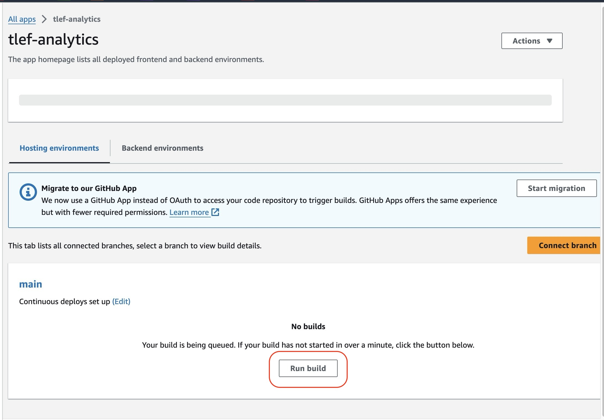
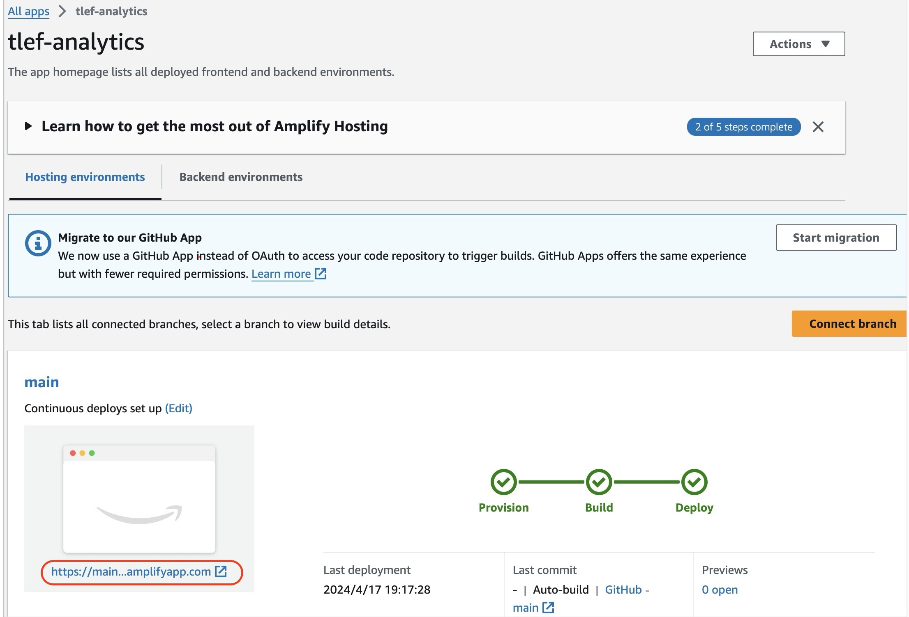

# Deployment walkthrough

## Table of Contents
- [Requirements](#requirements)
- [Pre-Deployment](#pre-deployment)
- [Deployment](#deployment)
    - [Step 1: Clone The Repository](#step-1-clone-the-repository)
    - [Step 2: Upload Secrets](#step-2-upload-secrets)
    - [Step 3: CDK Deployment](#step-3-cdk-deployment)
    - [Step 4: Upload Data](#step-4-upload-data)

## Requirements
Before you deploy, you must have the following installed on your device.
- [git](https://git-scm.com/downloads)
- [git lfs](https://git-lfs.com/)
- [AWS Account](https://aws.amazon.com/account/)
- [GitHub Account](https://github.com/)
- [AWS CLI](https://aws.amazon.com/cli/)
- [AWS CDK](https://docs.aws.amazon.com/cdk/v2/guide/cli.html) *(v2.122.0 > required)*
- [npm](https://docs.npmjs.com/downloading-and-installing-node-js-and-npm)
- [node](https://nodejs.org/en/learn/getting-started/how-to-install-nodejs) *(v20.0.0 > required)*

## Pre-Deployment
### Create GitHub Personal Access Token
To deploy this solution, you will need to generate a GitHub personal access token. Please visit [here](https://docs.github.com/en/authentication/keeping-your-account-and-data-secure/managing-your-personal-access-tokens#creating-a-personal-access-token-classic) for detailed instruction to create a personal access token.

*Note: when selecting the scopes to grant the token (step 8 of the instruction), make sure you select `repo` scope.*

**Once you create a token, please note down its value as you will use it later in the deployment process.**

## Deployment
### Step 1: Fork & Clone The Repository
First, you need to fork the repository. To create a fork, navigate to the [main branch](https://github.com/UBC-CIC/tlef-analytics) of this repository. Then, in the top-right corner, click `Fork`.


You will be directed to the page where you can customize owner, repository name, etc, but you do not have to change any option. Simply click `Create fork` in the bottom right corner.

Now let's clone the GitHub repository onto your machine. To do this:
1. Create a folder on your computer to contain the project code.
2. For an Apple computer, open Terminal. If on a Windows machine, open Command Prompt or Windows Terminal. Enter into the folder you made using the command `cd path/to/folder`. To find the path to a folder on a Mac, right click on the folder and press `Get Info`, then select the whole text found under `Where:` and copy with ⌘C. On Windows (not WSL), enter into the folder on File Explorer and click on the path box (located to the left of the search bar), then copy the whole text that shows up.
3. Clone the GitHub repository by entering the following command. Be sure to replace `<YOUR-GITHUB-USERNAME>` with your own username.
```
git clone https://github.com/<YOUR-GITHUB-USERNAME>/tlef-analytics
```
The code should now be in the folder you created. Navigate into the root folder containing the entire codebase by running the command:
```
cd tlef-analytics
```

### Step 2: Upload Secrets
You would have to supply your GitHub personal access token you created eariler when dpeloying the solution. Run the following command and ensure you replace `<YOUR-GITHUB-TOKEN>` and `<YOUR-PROFILE-NAME>` with your actual GitHub token and the appropriate AWS profile name.
```
aws secretsmanager create-secret \
    --name github-personal-access-token \
    --secret-string "{\"my-github-token\":\"<YOUR-GITHUB-TOKEN>\"}"\
    --profile <YOUR-PROFILE-NAME>
```

Moreover, you will need to upload your github username to Amazon SSM Parameter Store. You can do so by running the following command. Make sure you replace `<YOUR-GITHUB-USERNAME>` and `<YOUR-PROFILE-NAME>` with your actual username and the appropriate AWS profile name.

```
aws ssm put-parameter \
    --name "tlef-analytics-owner-name" \
    --value "<YOUR-GITHUB-USERNAME>" \
    --type String \
    --profile <YOUR-PROFILE-NAME>
```

### Step 3: CDK Deployment
It's time to set up everything that goes on behind the scenes! For more information on how the backend works, feel free to refer to the Architecture Deep Dive, but an understanding of the backend is not necessary for deployment.

Note this CDK deployment was tested in `ca-central-1` region only.

Open a terminal in the `/backend/cdk` directory.

**Download Requirements**: Install requirements with npm by running `npm install` command.

**Initialize the CDK stacks**(required only if you have not deployed any resources with CDK in this region before)
```
cdk synth --profile <your-profile-name>
cdk bootstrap aws://<YOUR_AWS_ACCOUNT_ID>/<YOUR_ACCOUNT_REGION> --profile <your-profile-name>
```

**Deploy CDK stacks**
You may run the following command to deploy the stacks all at once. Please replace `<profile-name>` with the appropriate AWS profile used earlier.
```
cdk deploy --all --profile <profile-name>
```
## Post-Deployment
### Step 1: Build AWS Amplify App
Log in to AWS console, and navigate to **AWS Amplify**. You can do so by typing `Amplify` in the search bar at the top.


Click `Run build` to start building the web application.


From `All apps`, click `tlef-analytics` to go to the app settings.

When the build is completed, you will see the screen as shown in the below image.
Please note down the URL highligted in red, as this will be the URL of the web application.



### Step 2: Upload Data
You will also need to upload data to Amazon S3. See our [user guide](./UserGuide.md) for details.

### Step 3: Visig Web App
Now you can navigate to the URL you created in step 1 to see your application in action.

### Extra: Taking down the deployed stacks
To take down the deployed stack for a fresh redeployment in the future, navigate to AWS Cloudformation, click on the stack(s) and hit Delete. Please wait for the stacks in each step to be properly deleted before deleting the stack downstream. The deletion order is as followed:

1. HostingStack
2. ApiStack
3. DatabaseStack
