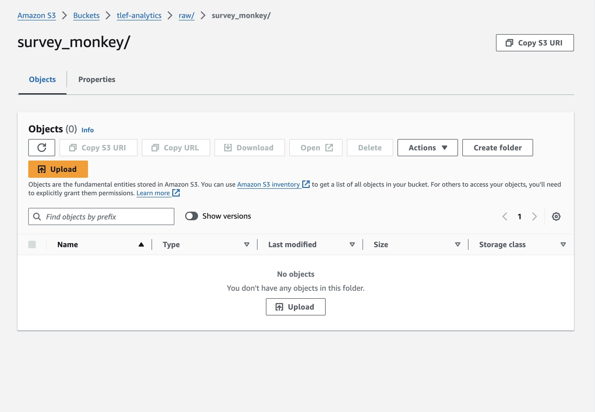

# How to Upload Data

## Table of Contents
- Introduction
- Project Details and Faculty Engagement
- Other Datasets
- Uploading Posters and Reports

# Introduction
The procedure of uploading the datasets differs depending on the dataset.\
Most datasets can be uploaded in a simple way, whereas uploading `project_details` and `faculty_engagement` datasets requires a few more additional steps.

# Project Details and Faculty Engagement
`project_details` and `faculty_engagement` datasets will be pre-populated by our data cleaning process of raw Survey Monkey data. You can then populate the generated files by filling in empty columns, then re-upload them to make them viewable from the web application.

## Step 1: Upload Raw Data Files
First, you need to upload the raw survey monkey file to `/raw/survey_monkey` folder within `tlef-analytics` bucket.

## Step 2: Initiate Glue Job

## Step 3: Complete Pre-Populated Datasets
After our first Glue job is completed, you will see two files generated as a result of our data cleaning process.\
`/raw/project_details` folder contains a new dataset named `project_details_{year}.xlsx` and `/raw/faculty_engagement` contains `faculty_engagement_{year}.xlsx`, where `{year}` represents the funding year of the dataset you uploaded earlier.

These datasets are formatted and cleaned, but miss a few columns which should be manually completed by the user. To make changes to the dataset, you first need to download the datasets onto your local computer.

Select the checkbox next to the item you would like to download, then click `Download` from the top menu. This will allow you to download the file onto your computer. You can then edit the file in Microsoft Excel.

## Step 4: Re-Upload Datasets
Once you finish editing the pre-populated datasets, you will need to re-upload the complete datasets back to Amazon S3 at the appropriate locations.

Before you upload the files, **make sure the file names are the same** as what you uploaded earlier in [Step 1](#step-1-upload-raw-data-files).\
Specifically, remove any number that has been added to the end of the file name, if there is any.\
ex. If your downloaded file is named like `project_details(1).xlsx`, remove `(1)` from the file name and re-upload it.

For `project_details_{year}.xlsx`, upload the files to `/raw/project_details` folder.\
`faculty_engagement_{year}.xlsx` files need to be uploaded to `/raw/faculty_engagement` folder.

## Step 5: Start the Second Glue Job
`faculty_engagement_{year}.xlsx` will be automatically converted and copied to `/staging/faculty_engagement` folder. 

***Glue Job description***

## Step 6: Edit Data
If you would like to edit data after [Step 5](#step-5-start-the-second-glue-job), you can repeat Steps 3 and 4 for changes to take place. 

# Other Datasets
## Step 1: Name Datasets Appropriately
When you upload datasets, make sure the file name follows our naming convention. Please check the table below for the details.

| data type | naming convention | example |
| --------- | ----------------- | ------- |
| Focus Area | focus_area_{year}.xlsx | focus_area_2024.xlsx |
| Faculty Options | options_faculty.xlsx | options_faculty.xlsx |
| Focus Area Options | options_focus_area.xlsx | options_focus_area.xlsx |
| Student Reach | student_reach_{year}.xlsx | student_reach_2024.xlsx |
| Unique Student | unique_student_{year}.xlsx | unique_student_2024.xlsx |
| Unsuccessful Projects | unsuccessful_projects_{year}.xlsx | unsuccessful_projects_2024.xlsx |

## Step 2: Uploading files
Once you name each file correctly, upload the files to the appropriate location in Amazon S3. Please refer to the table below for details.

| data type | location |
| --------- | -------- |
| Focus Area | `/raw/focus_area/` |
| Faculty Options | `/raw/options/faculties/` |
| Focus Area Options | `/raw/options/focus_area/` | 
| Student Reach | `/raw/student_reach/` |
| Unique Student | `/raw/unique_student/` | 
| Unsuccessful Projects | `/raw/unsuccessful_projects/` |

After you upload each file to the correct location in the S3 bucket, data preparation process will automatically be triggered and the files will be stored into `/staging/` folder.

You can then preview the data you uploaded from the web application.

## Step 3: Editing Datasets
If you would like to edit the contents of the datasets after the initial uploads, you can follow the procedures described below.

### Step 3.1: Downloading File onto Local Computer
Select the checkbox next to the item you would like to make changes to, then click `Download` from the top menu. This will allow you to download the file onto your computer. You can then edit the file in Microsoft Excel.

### Step 3.2: Re-Uploading Datasets

